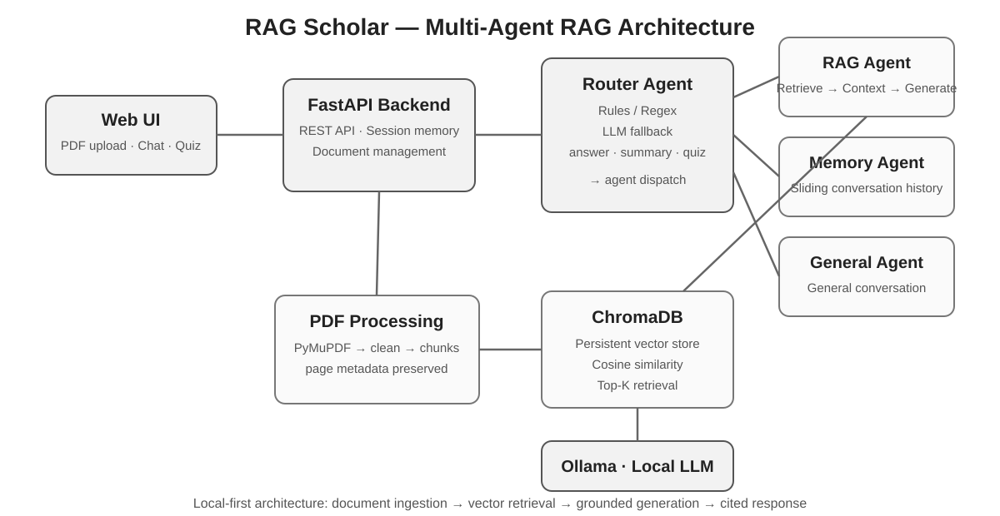

# RAG  — Multi-Agent Learning Assistant

Local-first RAG application for studying from PDF courses, combining **FastAPI, Ollama, ChromaDB, embeddings and specialized AI agents**.

## Main project

See the full implementation in **rag-learning-assistant/**.

### Core capabilities

- PDF upload and text extraction
- Chunking with page metadata
- Local embeddings with **nomic-embed-text**
- Persistent vector search with **ChromaDB**
- Multi-agent routing for different user intents
- Grounded RAG answers with file/page sources
- Course summaries
- Automatically generated 5-question quizzes
- Sliding conversation memory
- General chat mode
- FastAPI REST API and web interface

### Architecture



### Stack

**Python · FastAPI · Ollama · ChromaDB · PyMuPDF · Embeddings · RAG · AI Agents · REST API**

## Screenshots to add

For the portfolio, the most useful screenshots are:

1. **Main UI** — the application with the sidebar, modes and chat area.
2. **RAG answer** — a question answered from a PDF with the displayed source and page.
3. **Quiz mode** — generated QCM with answer feedback.
4. **PDF indexing** — uploaded document visible in the document list.

Recommended location:

```text
rag-learning-assistant/docs/images/
├── architecture.svg
├── ui-overview.png
├── rag-answer.png
├── quiz-mode.png
└── pdf-indexing.png
```
