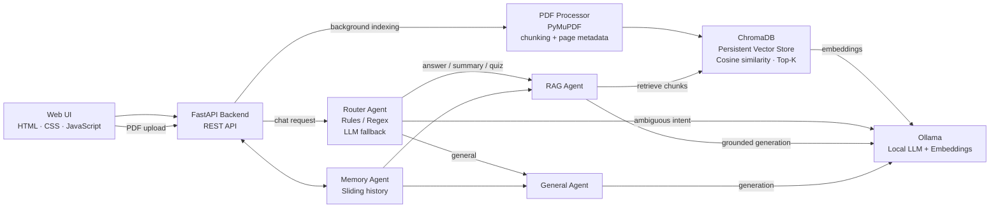
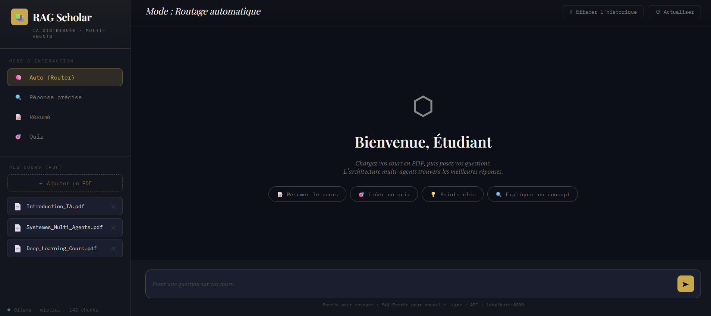
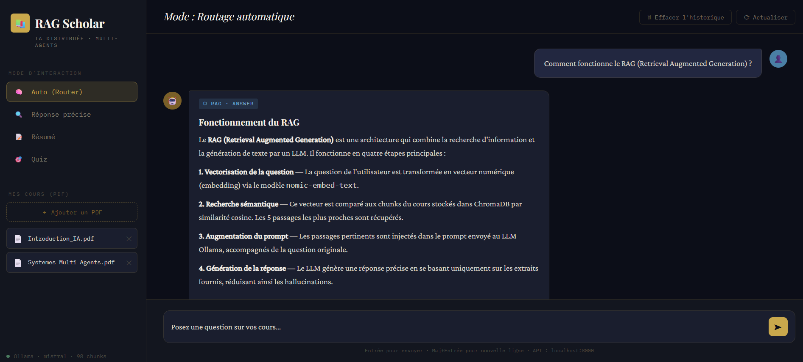
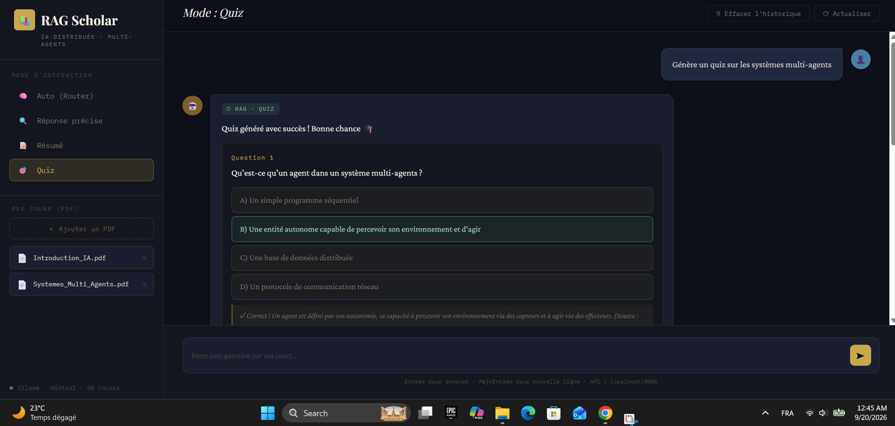
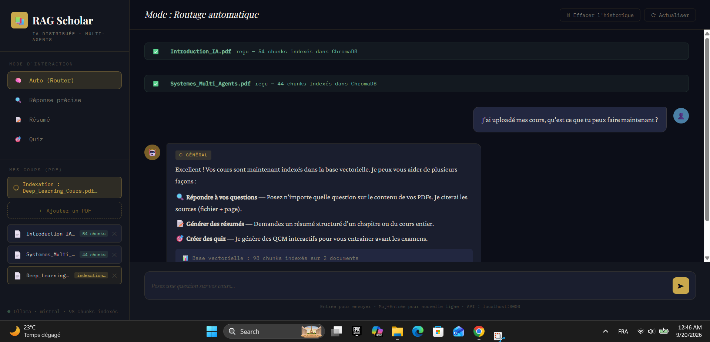

# RAG Scholar — Multi-Agent Learning Assistant

Local-first RAG application for studying from PDF courses, combining **FastAPI, Ollama, ChromaDB, embeddings and specialized AI agents**.

## Main project

See the full implementation in **rag-learning-assistant/**.

### Core capabilities

- PDF upload and text extraction
- Chunking with page metadata
- Local embeddings with **nomic-embed-text**
- Persistent vector search with **ChromaDB**
- Multi-agent routing for different user intents
- Grounded RAG answers with file/page sources
- Course summaries
- Automatically generated 5-question quizzes
- Sliding conversation memory
- General chat mode
- FastAPI REST API and web interface

## Architecture

## Screenshots

### Main interface

### RAG answer with sources

### Quiz mode

### PDF indexing

## Stack

**Python · FastAPI · Ollama · ChromaDB · PyMuPDF · Embeddings · RAG · AI Agents · REST API**

For installation, configuration, REST endpoints and the full technical explanation, see the project README in **rag-learning-assistant/**.